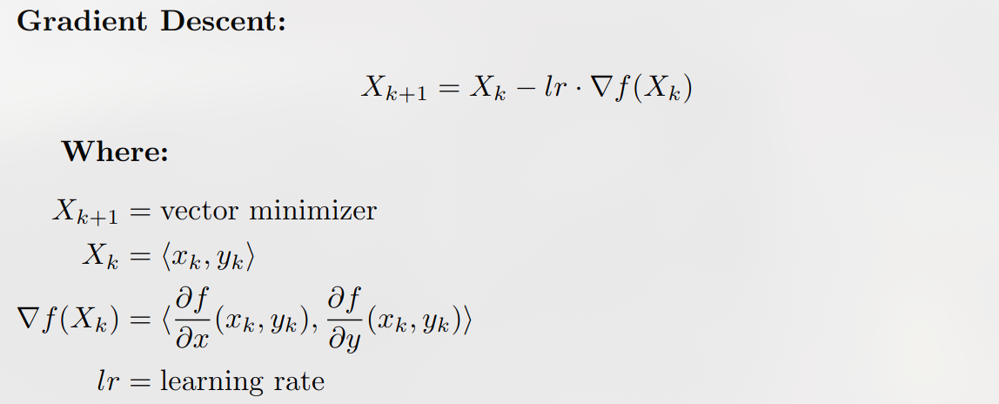

# Submission for CPSC210 final project

## Project Description  

**What will the application do?**
This application will allow users to input a scalar field (xy function wrt z) and visualize a general gradient descent algorithm in a 3D space. I implemented a camera controller after taking MATH 200 (Multivariable Calculus) and multithreading (simple concurrency) after taking CPSC 313 (Computer Hardware and Operating Systems).

**Who will use it?**
I mainly created this application as a tool to help students visualize gradient descent in a gamified simulation. 

**Why is this project of interest to you?**
While taking multivariable calculus, I realized that much of deep learning is just multiple variables with a little twist. Since I took CPSC213 (Computer Systems) over the summer, I also gained a lot of appreciation for DiskIO manipulation and concurrency. For this project, I wanted to compile all my knowledge and apply it into this 3D rendering engine with deep learning visualization. I also gained a lot of inspiration from my friend @NathanielHawron who created a similar but much more complex rendering engine in OpenGL and Vulkan that has modeling capability (something I have been considering to implement in my Java rendering engine).

This project is part of one of my larger projects which is a gamified Deep Learning bootcamp with highlight on 3D simulations, graphics, for all the operations applied in Deep Learning. Eventually, I will be displaying graphical matrices and how convolution, transformations, etc look like in 3D. 

**Key elements of the project include:**  
- 3D rendering engine
    - Vector transformations (3D -> 2D -> projection -> rasterization)
    - Concurrency locks for full frame updating
- Persistance
    - Saving gradient state (will be used for save/load model state)
    - Saving minimzer values
    - simState (which includes field, DL parameters, and time)
- JPanel and JFrame
    - A ful GUI implemented with javax.swing where user can modify simulation in real-time (concurrency)

---

## User Stories  
- As a user, I want to be able to interact with the simulation environment and move around
- As a user, I want to be able to modify the simulation in real-time without my computer crashing
- As a user, I want to be able to visualize scalar fields (which are just multivariable functions wiht a z axis) in the simulation
- As a user, I want to be able to visualize how gradient descent optimizes a minimizer because I have no idea how to understand it
- As a user I want to be able to clone the repository and continue off from the saved model state (right now, I only save the minimizer and updated weights/parameters which I really only have one lol which is the minimizer itself)